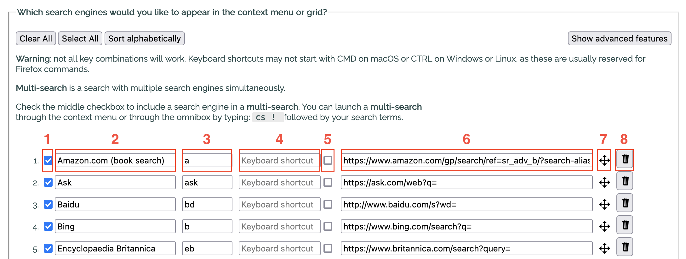

# Context Search

Firefox add-on to search selected text in a web page using your favorite search engines.

## Permissions

**Notifications**, **Downloads**, **History** and **Bookmarks** are now optional permissions. They are disabled by default. If you'd like to show notifications and/or save your list of search engines to your local disk, or search your history or bookmarks from the Omnibox, then open the extensions manager, select Context Search and, under the Permissions tab, enable the appropriate permissions.

To open search results in a new private window, in the extensions manager, allow Context Search to <em>"Run in Private Windows"</em>.

## How does it work

<ol>
<li>Select some text on a webpage</li>
<li>Right click (or Alt-click) on a selection</li>
<li>A context menu (or a grid of icons) appears, displaying the list of search engines chosen in the extension's preferences</li>
<li>Click on the search engine with which you’d like to search for the selected text</li>
</ol>

The search results will appear as defined in the extension's preferences page.

## Managing search engines

To manage your favorite search engines, you can go to the preferences page of Context Search. You can reach this page by opening the extensions page (Addon Manager) where all your add-ons are listed and then clicking on the "Preferences" button.



Please refer to the 4th screenshot above.

<ol>
<li>The checkbox at the start of a line determines whether the search engine should appear in the context menu.</li>
<li>The next item on the line contains the name of the search engine and is followed by a keyword.</li>
<li>This keyword is used in the url address bar (or omnibox) after the word “cs “ and before the search terms (e.g. to search for linux using the search engine Wikipedia, you would type: ‘cs w linux’, where w is the keyword assigned to Wikipedia).</li>
<li>Next, you can assign a keyboard shortcut to a search engine to perform a quick search. Please note that not all key combinations will work as some may be reserved by the browser or your system.</li>
<li>The second checkbox specifies whether you’d like to use the search engine in a “multi-search”. A “multi-search” is a search performed using multiple search engines and can be selected in the context menu of in the grid of icons.</li>
<li>The checkbox is followed by the search query string. This is the generic url you would use to perform a search. Search query strings may contain the parameters %s or {searchTerms} where you'd like your search terms, i.e. the selected text, to appear.</li>
<li>Click on and drag the move icon to the left of the trash icon to move each search engine up or down in the list.</li>
<li>Click on the trash icon to remove a search engine from the list.</li>
</ol>

The 'Reset' button will re-load the default list of search engines and their associated favicons.

You can also import a JSON file containing your own list of search engines. It is strongly recommended to export your customized list of search engines as a backup in case anything goes wrong.

## How to add a search engine to your custom list of search engines

* visit mycroftproject.com and click on the Context Search icon that appears before the textual link of a listed search engine
* use the page action (i.e. Context Search icon in the url address bar) to add a search engine if the website supports open search
* add a search engine manually via the Options page (you can test the query string before adding the search engine)
* to add a search engine that uses a submit form via an HTTP POST request, double click in the website's search text box

## How to add an AI prompt to your custom list of search engines

Prior to using an AI provider, ensure that you have logged in to their website. At the bottom of the Options page, select the tab to 'Add a new AI prompt'. Chose the AI provider you'd like to use, add a name for your prompt and enter your prompt by inserting %s where you'd like your text selection to appear (e.g. 'Comprehensively explain the following for a 10 year old: %s'). 

In most cases, after selecting text on a web page and selecting your prompt in the context menu, a new tab will open with the prompt pasted in the search box. However, pressing the ENTER key will not work! You have to place the cursor in the search box, then press the SPACE bar and finally press the ENTER key. The search results should then appear.

At any time, you may press CMD + V to paste you prompt if it doesn't appear.

## How to add a separator (horizontal line) in the context menu

At the bottom of the Options page, simply click on the "Add separator" button. This will add a separator to the bottom of your search engines list. Then, use the arrow handle to the right of the horizontal line to move the separator to the position where you would like it to be. The separator should appear in the context menu.

## How to add a custom favicon for a search engine

From the Options page, click on the favicon right before the search engine's name. A popup window will open displaying the current favicon and the associated base64 string. Drag & drop a new image onto the existing one, then click on the 'Save' button for your changes to take effect. The popup will automatically close after you click on the 'Save' button.

## How to perform a search in the omnibox

In the omnibox (or url address bar), type 'cs ' (without the quotes, and where cs stands for Context Search) followed by the keyword you have chosen for your seaarch engine in the extension's preferences, e.g. 'w ' (again without quotes) for Wikipedia, followed by your search term(s). The dot ('.'), the exclamation mark ('!'), '!h' or 'history' and '!b' or 'bookmarks' are reserved keywords. If the same keyword is used for different search engines, then a multi-search will be performed.

Here are some examples:

**cs w atom**
will search for the word 'atom' in Wikipedia.

**cs .**
will open the Options page

**cs ! cold fusion**
will perform a multi-search for the search terms 'cold fusion'

**cs !h** or c**s history**
will display all your history

**cs !b Mozilla** or c**s bookmarks Mozilla**
will display all bookmarks that include the term Mozilla

**cs !b recent** or **cs bookmarks recent**
will display your 10 most recent bookmarks

Please note that permissions for History and/or Bookmarks need to be anabled for the latter features to work.

## Advanced feature

You can add a regular expression to each search engine. If the selected text matches the regex, then the search engine will appear in the context menu. As an example, imagine you had a search engine for booking.com and another for tripadvisor.com and you would like these search engines to appear in the context menu when a selection contains the word 'hotel'. Then, for those search engines, you'd enter the regex /hotel/. If you then make any other selection that doesn't contain the word "hotel" in it, those search engines won't appear in the context menu. There's a very useful website for building a regex: [https://regex101.com](https://regex101.com). Another example is, if you select an IP address, then you might want the search engine corresponding to whatismyipaddress.com to appear. The regex here is a little more complicated to establish, but Google can help: search Google for "regex for ip address".

## The main structure of a JSON file containing the search engines

```javascript
{
  "id": {
    "index": 0,
    "name": "search engine's name",
    "keyword": "keyword to be used in an omnibox search",
    "keyboardShortcut": "keyboard shortcut assigned to the search engine",
    "multitab": "takes the value true or false depending on whether this search engine should be included in a multi-search or not",
    "url": "search engine query string (without the search terms)",
    "show": "takes the value true if the search engine is to be shown in the context menu or false if not",
    "base64": "a base 64 string representation of the search engine's favicon" 
  }
}
```

Here is an example of a JSON file containing 3 search engines:

```javascript
{
  "bing": {
    "index": 0,
    "name": "Bing",
    "keyword": "b",
    "keyboardShortcut": "",
    "multitab": false,
    "url": "https://www.bing.com/search?q=",
    "show": true,
    "base64": ""
  },
  "google": {
    "index": 1,
    "name": "Google",
    "keyword": "g",
    "keyboardShortcut": "",
    "multitab": false,
    "url": "https://www.google.com/search?q=",
    "show": true,
    "base64": ""
  },
  "yahoo": {
    "index": 2,
    "name": "Yahoo!",
    "keyword": "y",
    "keyboardShortcut": "",
    "multitab": false,
    "url": "https://search.yahoo.com/search?p=",
    "show": true,
    "base64": ""
  }  
}
```

It is not required to provide the base 64 string representation of any search engine's favicon. This string will automatically be loaded for you.

## Special thanks to the following contributors

<ul>
<li>Carl Scheller for implementing the drag & drop feature to move search engines in the Options page</li>
<li>Geoffrey De Belie for the Dutch translation</li>
<li>Krzysztof Galazka for the Polish translation</li>
<li>Sergio Tombesi for the Italian and Spanish translations</li>
<li>Fushan Wen for the Chinese translation</li>
<li>Sveinn í Felli for the Icelandic translation</li>
</ul>

## Code made by others used in this extension

- SortableJS v1.15.0 minified with many contributors, which can be found on GitHub here: https://github.com/SortableJS/Sortable/blob/1.15.0/Sortable.min.js
