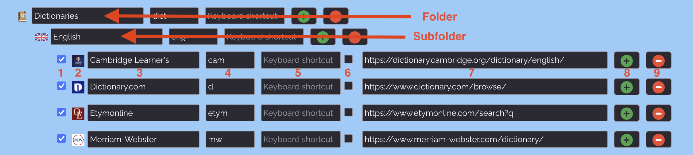

# Context Search

Firefox and Chrome cross-browser extension to search selected text in a web page using your favorite search engines or your preferred AI chatbot and AI prompts.

[Firefox add-on](https://addons.mozilla.org/en-US/firefox/addon/contextsearch/)

[Chrome extension](https://chromewebstore.google.com/detail/context-search/kpgbcibefipipfnjiomkinfphlkballh)


## Features

* Added dark theme for the Options page
* Access search engines from the Context Menu
* Access search engines from an Icons Grid
* Compatible with search engines using either HTTP GET or HTTP POST requests
* Reverse-image search using Google, Google Lens or TinEye
* Site search
* Carry out multiple searches at once using multisearch or folder multisearch
* Manage your search engines from the extension's Options page
* Many ways to easily add a new search engine
* Support for search engines using OpenSearch description format
* Simply add a search engine from mycroftproject.com
* Use custom favicons for your search engines
* Use custom prompts to question a selection of AI chatbots
* Carry out searches from the Omnibox, i.e. url address bar
* Assign keyboard shortcuts to your search engines
* Export/Import your list of search engines as a safe backup


## Optional Permissions in Firefox

**Notifications**, **Downloads**, **History** and **Bookmarks** are optional permissions in Firefox. They are disabled by default. If you'd like to:
- show notifications and/or 
- save your list of search engines to your local disk, or 
- search your history or bookmarks from the Omnibox, or

then open the extensions manager, select Context Search and, under the Permissions tab, enable the appropriate permissions.

To open search results in a new private window, in the extensions manager, allow Context Search to <em>"Run in Private Windows"</em>.


## How does it work

<ol>
<li>Select some text on a webpage</li>
<li>Right click (or Alt-click) on a selection</li>
<li>A context menu (or a grid of icons) appears, displaying the list of search engines chosen in the extension's preferences</li>
<li>Click on the search engine with which you’d like to search for the selected text</li>
</ol>

The search results will appear as defined in the extension's preferences page.


## Managing search engines

To manage your favorite search engines, you can go to the preferences page of Context Search. You can reach this page by opening the extensions page (Addon Manager) where all your add-ons are listed and then clicking on the "Preferences" button.



<ol>
<li>The checkbox at the start of a line determines whether the search engine should appear in the context menu.</li>
<li>The favicon or icon (which can be edited) of the search engine.</li>
<li>The next item on the line contains the name of the search engine and is followed by a keyword.</li>
<li>This keyword is used in the url address bar (or omnibox) after the word “cs “ and before the search terms (e.g. to search for linux using the search engine Wikipedia, you would type: ‘cs w linux’, where w is the keyword assigned to Wikipedia).</li>
<li>Next, you can assign a keyboard shortcut to a search engine to perform a quick search. Please note that not all key combinations will work as some may be reserved by the browser or your system.</li>
<li>The second checkbox specifies whether you’d like to use the search engine in a “multi-search”. A “multi-search” is a search performed using multiple search engines and can be selected in the context menu of in the grid of icons.</li>
<li>The checkbox is followed by the search query string in the case of an HTTP GET request or the url for the search engine in the case of an HTTP POST request. This is the generic url you would use to perform a search. Search query strings may contain the parameters %s or {searchTerms} where you'd like your search terms, i.e. the selected text, to appear. If the search is carried out using an HTTP POST request, then a textarea will appear to enter the form data.</li>
<li>The green plus icon allows you to add a new search engine as the next sibling to the list.</li>
<li>The red minus icon allows you to remove a search engine or a folder and its entire contents from the list.</li>
</ol>

The 'Reset' button will re-load the default list of search engines and their associated favicons.

You can also import a JSON file containing your own list of search engines. It is strongly recommended to export your customized list of search engines as a backup in case anything goes wrong.


## What is an AI Search?

There are 2 types of AI searches that can be performed:

1) A **predefined AI Search** based on a prompt that you have saved in the Options page. You first select text on a web page which will be used as the context for your AI search. In your AI prompt template, %s will be replaced by the selected text. A predefined AI search is launched by clicking on the AI chatbot (which contains the AI prompt template that you want to use) from the context menu or from the grid of icons. For example, you could select a code block in a web page and use the AI chatbot ChatGPT with the AI prompt "Explain %s". This would open a new tab with the answer from ChatGPT explaining the code block selected.

2) A **one-time AI Search** is not based on an existing AI prompt. A one-time AI search can be triggered in one of 2 ways: either by selecting "AI search..." from the context menu or by pressing the keyboard shortcut Alt+K. In both cases a new prompt window will open where you may first type the keyword corresponding to the AI chatbot that you'd like to use followed by a 'Space' character and then your AI prompt (which may contain %s if you'd like to use your text selection as the context for your AI search). Finally, press Enter.

Typically, the predefined AI Search is based on an AI prompt template that you often plan to use, whereas the one-time AI Search, as its name suggests, is intended for a quick one-time use.


## How to add a search engine to your custom list of search engines

* visit mycroftproject.com and click on the Context Search icon that appears before the textual link of a listed search engine
* use the page action (i.e. Context Search icon in the url address bar) to add a search engine if the website supports open search
* add a search engine manually via the Options page (you can test the query string before adding the search engine)
* to add a search engine that uses a submit form via an HTTP POST request, double click in the website's search text box, then at least enter a search engine name in the dialog box that appears

[Here is a video](https://youtu.be/_kV7JCgGQLk) demonstrating the different ways that you can add a search engine to your custom list of search engines.


## How to add an AI prompt template to your custom list of search engines

> [!TIP]
> For trouble-free use, **it is recommended that you log in** prior to using an AI chatbot. This is required when using ChatGPT, Claude, Google AI Studio and Poe.

On the Options page, first select the Search engines tab, then click on a green plus button where you'd like to add your new AI search. 

Then, select the tab to 'Add a new AI prompt'. Chose the AI chatbot you'd like to use, add a name for your AI prompt and enter your AI prompt template by inserting %s where you'd like your text selection to appear (e.g. 'Comprehensively explain the following for a college student: %s'). 

In most cases, after selecting text on a web page and clicking your prompt in the context menu, a new tab will open with the relevant AI chatbot. When possible, the AI prompt will be pasted in the search box and automatically submitted to the AI chatbot, except for Poe so that users can choose their preferred large language model. The search results should then appear.

N.B.: If the prompt is missing from the text area, you can paste the contents of the clipboard to which your AI prompt will have been copied. For this to work, you have to enable the Clipboard permission in the extension's preferences. Alternatively, it is possible to use ChatGPT's AI chatbots on Poe.


## How to add a separator (horizontal line) in the context menu

At the bottom of the Options page, simply click on the "Add separator" button. This will add a separator to the bottom of your search engines list. Then, use the arrow handle to the right of the horizontal line to move the separator to the position where you would like it to be. The separator should appear in the context menu.


## How to add a custom favicon for a search engine

From the Options page, click on the favicon right before the search engine's name. A popup window will open displaying the current favicon and the associated base64 string. Drag & drop a new image onto the existing one, then click on the 'Save' button for your changes to take effect. The popup will automatically close after you click on the 'Save' button.


## How to perform a one-time AI search using the AI prompt window

> [!TIP]
> Prior to using this feature, **ensure that you have logged in** to the website(s) of the AI chatbot(s) that you'd like to use. This is required when using ChatGPT, Claude, Google AI Studio and Poe. 

'ALT+K' opens an AI prompt window from which to carry out a one-time AI search. Start by typing the keyword corresponding to the AI chatbot that you'd like to use followed by a 'Space' character. The current list of valid keywords is:

- chatgpt
- claude
- gemini (for Google AI Studio where different models are available)
- grok
- perplexity
- poe (where you can choose amongst different LLMs)
- andi

 If the AI chatbot is recognized, then it will automatically be styled as a tag. You can then continue typing your AI prompt completed by 'Enter'. The AI prompt window should then close and the search results be displayed in a new tab. Unless you are using Poe, then an additional step is required: select the LLM you'd like to use and submit the prompt.


## How to perform a search in the omnibox

In the omnibox (or url address bar), type 'cs ' (without the quotes, and where cs stands for Context Search) followed by the keyword you have chosen for your seaarch engine in the extension's preferences, e.g. 'w ' (again without quotes) for Wikipedia, followed by your search term(s). The dot ('.'), the exclamation mark ('!'), '!h' or 'history' and '!b' or 'bookmarks' are reserved keywords. If the same keyword is used for different search engines, then a multi-search will be performed.

Here are some examples:

**cs w atom**
will search for the word 'atom' in Wikipedia.

**cs .**
will open the Options page

**cs ! cold fusion**
will perform a multi-search for the search terms 'cold fusion'

**cs !h** or **cs history**
will display all your history

**cs !b Mozilla** or **cs bookmarks Mozilla**
will display all bookmarks that include the term Mozilla

**cs !b recent** or **cs bookmarks recent**
will display your 10 most recent bookmarks

> [!NOTE]
> Please note that permissions for History and/or Bookmarks need to be anabled for the latter features to work.


## The main structure of a JSON file containing the search engines

```javascript
{
  "id": {
    "index": 0,
    "name": "search engine's name",
    "keyword": "keyword to be used in an omnibox search",
    "keyboardShortcut": "keyboard shortcut assigned to the search engine",
    "multitab": "takes the value true or false depending on whether this search engine should be included in a multi-search or not",
    "url": "search engine query string (without the search terms)",
    "show": "takes the value true if the search engine is to be shown in the context menu or false if not",
    "base64": "a base 64 string representation of the search engine's favicon" 
  }
}
```

Here is an example of a JSON file containing 3 search engines:

```javascript
{
  "bing": {
    "index": 0,
    "name": "Bing",
    "keyword": "b",
    "keyboardShortcut": "",
    "multitab": false,
    "url": "https://www.bing.com/search?q=",
    "show": true,
    "base64": ""
  },
  "google": {
    "index": 1,
    "name": "Google",
    "keyword": "g",
    "keyboardShortcut": "",
    "multitab": false,
    "url": "https://www.google.com/search?q=",
    "show": true,
    "base64": ""
  },
  "yahoo": {
    "index": 2,
    "name": "Yahoo!",
    "keyword": "y",
    "keyboardShortcut": "",
    "multitab": false,
    "url": "https://search.yahoo.com/search?p=",
    "show": true,
    "base64": ""
  }  
}
```

> [!NOTE]
> It is not required to provide the base 64 string representation of any search engine's favicon. This string will automatically be loaded for you.


## Special thanks to the following contributors

<ul>
<li>Carl Scheller for implementing the drag & drop feature to move search engines in the Options page</li>
<li>Geoffrey De Belie for the Dutch translation</li>
<li>Krzysztof Galazka for the Polish translation</li>
<li>Sergio Tombesi for the Italian and Spanish translations</li>
<li>Fushan Wen for the Chinese translation</li>
<li>Sveinn í Felli for the Icelandic translation</li>
</ul>

Other translations were completed using [DeepL](https://www.deepl.com/translator), Microsoft Translator and Google Translate in [Crowdin](https://crowdin.com).


## Code made by others used in this extension

- Webextension-polyfill v0.12.0 minified with many contributors, which can be found on GitHub here: https://github.com/mozilla/webextension-polyfill
- SortableJS v1.15.6 minified with many contributors, which can be found on GitHub here: https://github.com/SortableJS/Sortable/blob/1.15.6/Sortable.min.js
